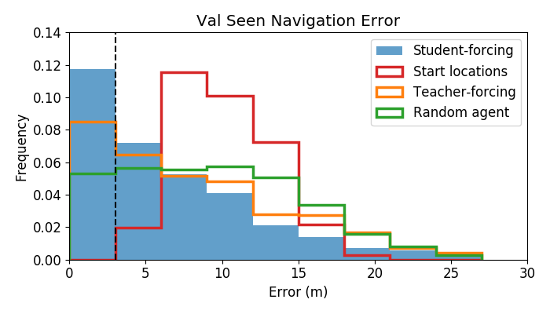

# Room-to-Room (R2R) Navigation Task


## Download Data

Data consists of train/val-seen/val-unseen/test splits. There are two validation sets to better understand generalization performance between buildings that are in the training set (val-seen) and unseen buildings. The test set consists entirely of unseen buildings. 

To download, from the top level directory, run:
```
./tasks/R2R/data/download.sh
```

Data is formatted as follows:
```
{
  "distance": float,
  "scan": str,
  "path_id": int,
  "path": [str x num_steps],
  "heading": float,
  "instructions": [str x 3],
}
```
- `distance`: length of the path in meters.
- `scan`: Matterport scan id.
- `path_id`: Unique id for this path.
- `path`: List of viewpoint ids (the first is is the start location, the last is the goal location)
- `heading`: Agents initial heading in radians (elevation is always assumed to be zero).
- `instructions`: Three unique natural language strings describing how to find the goal given the start pose.

For the test set, only the first path_id (starting location) is included. We will provide a test server for scoring uploaded trajectories according to the metrics in the [paper](https://arxiv.org/abs/1711.07280).

## Directory Structure

- `env.py`: Wraps the simulator and adds language instructions, with several simplifications -- namely discretized heading / elevation and pre-cached image features. This is not intended to be a standard component, or to preclude the use of continous camera actions, end-to-end training etc. Use the simulator and the data as you see fit, but this can provide a starting point.
- `utils.py`: Text pre-processing, navigation graph loading etc.
- `eval.py`: Evaluation script.
- `model.py`: PyTorch seq2seq model with attention.
- `agent.py`: Various implementations of an agent.
- `train.py`: Training entrypoint, parameter settings etc.
- `plot.py`: Figures from the arXiv paper.

## Prerequisites

Python 3, [PyTorch](http://pytorch.org/), [NetworkX](https://networkx.github.io/), [pandas](https://pandas.pydata.org/), etc. These should already be installed in the docker image, or can be installed by running:
```
pip3 install -r tasks/R2R/requirements.txt
```


## Training and Evaluation

There is a test server and leaderboard available at [EvalAI](https://evalai.cloudcv.org/web/challenges/challenge-page/97/overview). 

To train the baseline seq2seq model with student-forcing:
```
python3 tasks/R2R/train.py
```

To run some simple learning free baselines:
```
python3 tasks/R2R/eval.py
```

Generate figures from the paper:
```
python3 tasks/R2R/plot.py
```

The simple baselines include:
- `ShortestAgent`: Agent that always follows the shortest path to goal (foundation for supervised training).
- `RandomAgent`: Agent that randomly picks a directly, then tries to go straight for 5 viewpoints.
- `StopAgent`: Agent that remains at the starting position.


